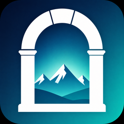
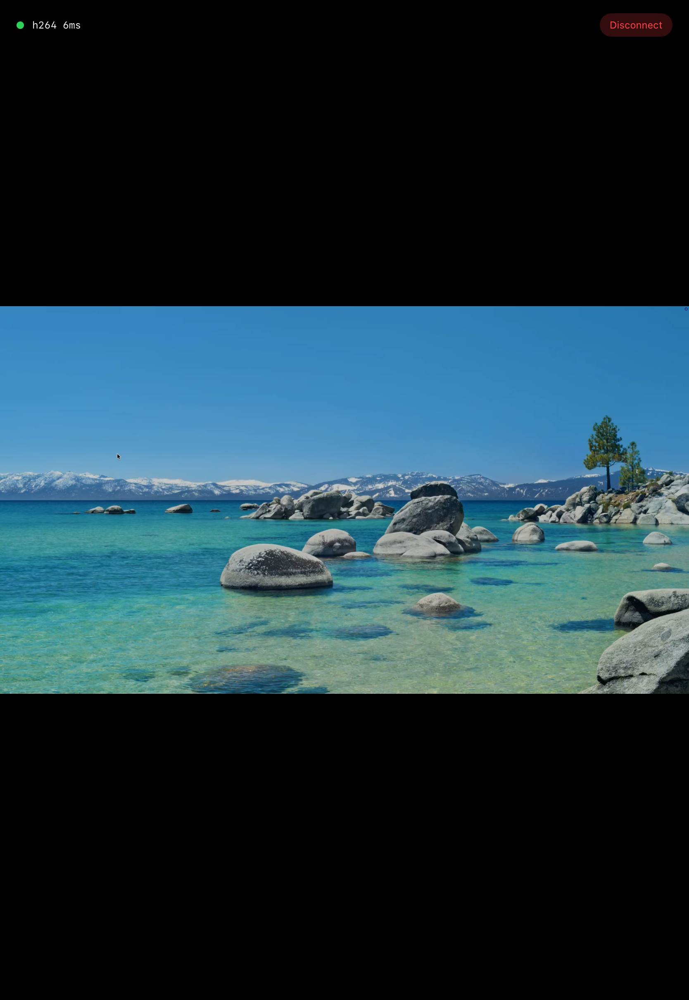

<p align="center">
  
</p>

<h1 align="center">Mirador</h1>

<p align="center"><em>Real-time VNC for macOS — view and control your Mac from your iPhone &amp; iPad.</em></p>

Mirador streams your Mac's screen as **hardware-encoded H.264** over a WebSocket and relays
keyboard / trackpad / touch input back — a low-latency remote desktop that feels far smoother than
traditional VNC. It includes a tiny macOS host service, a zero-install browser viewer, and a native
universal **SwiftUI app for iPhone &amp; iPad**.

> ⚠️ **Experimental.** LAN / Tailscale-first, token-authenticated, **no public relay**. Treat input
> injection as sensitive (see [Security](#security)).

<p align="center">
  
</p>

## How it works

```
ScreenCaptureKit ─▶ VideoToolbox H.264 (hardware, High profile)
        │
        ├─▶  /ws/video  (binary WebSocket)  ─▶  Safari WebCodecs → <canvas>   (browser viewer)
        │                                   └▶  AVSampleBufferDisplayLayer    (native app)
        └─▶  /stream.mjpg  (MJPEG fallback for browsers without WebCodecs)

iPhone / iPad ─▶  /ws/input  (keyboard · trackpad · touch, JSON)  ─▶  CGEvent injection
```

- **Idle = zero cost.** No ScreenCaptureKit or VideoToolbox runs until a viewer connects; the
  pipeline tears down when the last one disconnects (idle RSS ~12 MB).
- **Lean.** H.264 is ~6× lighter than the MJPEG path at equal fps/resolution, and collapses to a
  trickle on a static screen.
- **Native = lowest latency.** The iOS app decodes over a raw socket, so it connects directly on the
  LAN with no HTTPS hop (the browser's WebCodecs needs a secure context — see Security).

## Repo layout

| Path | What |
| --- | --- |
| `Sources/Mirador/` | macOS host service (capture, H.264 encode, HTTP/WebSocket server, input injection) |
| `web/` | Browser viewer (`viewer.html` + assets) |
| `clients/Mirador/` | Native universal SwiftUI app (iPhone &amp; iPad) — built with XcodeGen |
| `scripts/` | Signing + LaunchAgent install/uninstall, live-verify, perf harness |
| `launchd/` | LaunchAgent template |
| `docs/measurements.md` | Performance baselines &amp; methodology |

## Quick start

### 1. Run the host (macOS 15+)

```sh
# stable code-signing identity so Screen Recording / Accessibility grants persist across rebuilds
./scripts/setup-signing-identity.sh
./scripts/install-launchagent.sh build
./scripts/install-launchagent.sh install
```

Grant **Screen Recording** and **Accessibility** to the built binary when macOS prompts
(System Settings → Privacy &amp; Security). The service listens on `:8787` and prints a URL with a
capability token; the token is also written to `~/.mirador-token`.

### 2. Browser viewer

Open `http://<mac-ip>:8787/?token=<token>` on any device on your network.
> Safari's WebCodecs requires a **secure context**, so over a plain LAN IP the browser uses the
> MJPEG fallback. For hardware H.264 in the browser, serve over HTTPS — e.g. `tailscale serve 8787`
> and open the `https://<host>.ts.net/` URL.

### 3. Native app (iPhone / iPad)

```sh
brew install xcodegen
cd clients/Mirador
xcodegen generate
open Mirador.xcodeproj   # set your Development Team, pick your device, Run
```

Enter your Mac's host/IP (or Tailscale name), port `8787`, and the token. The native app uses
hardware H.264 directly over `ws://` — no HTTPS needed.

## Security

- Capability **token** required on every endpoint (`?token=` or `X-Mirador-Token`).
- Designed for **LAN and Tailscale/VPN**; there is **no public relay**.
- Input injection is real keyboard/mouse control of your Mac — only run this on networks you trust,
  and prefer Tailscale over exposing the port. If you must reach it over the internet, put it behind
  an authenticated tunnel (e.g. Cloudflare Access).

## Development

```sh
swift build && swift test     # host service + 80 tests
./scripts/measure.sh          # performance harness (capture / encode / latency)
```

## License

[MIT](LICENSE) © 2026 Arnab Saha.
